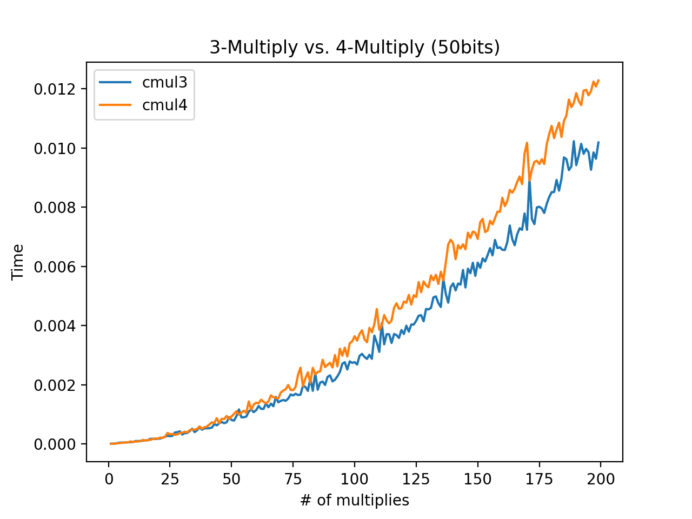
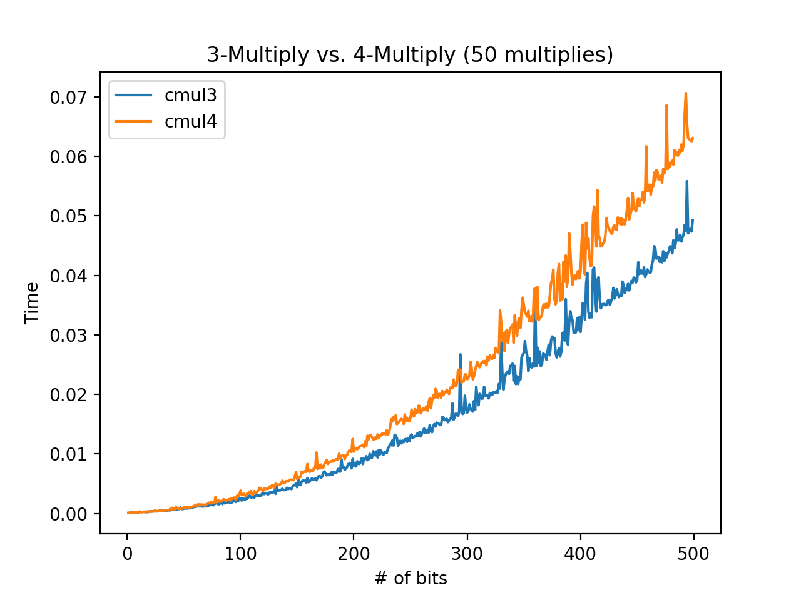
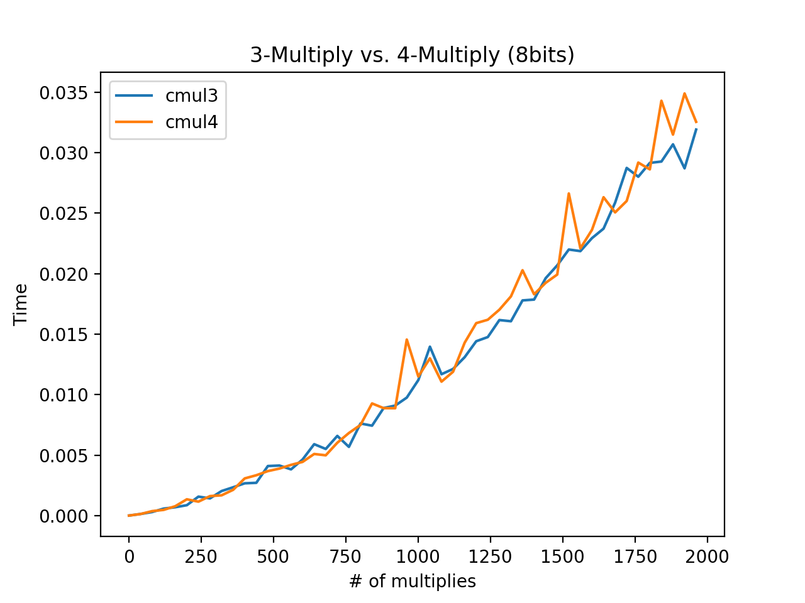
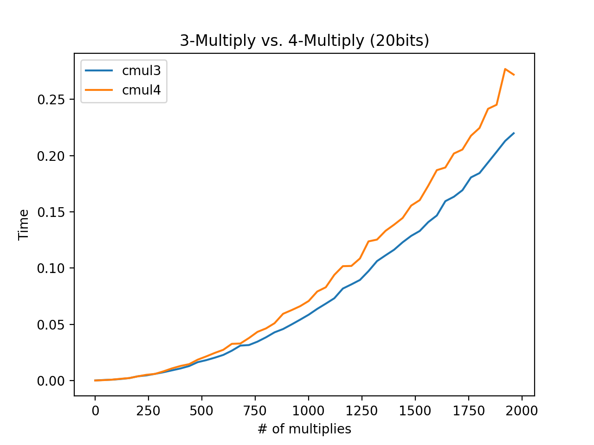
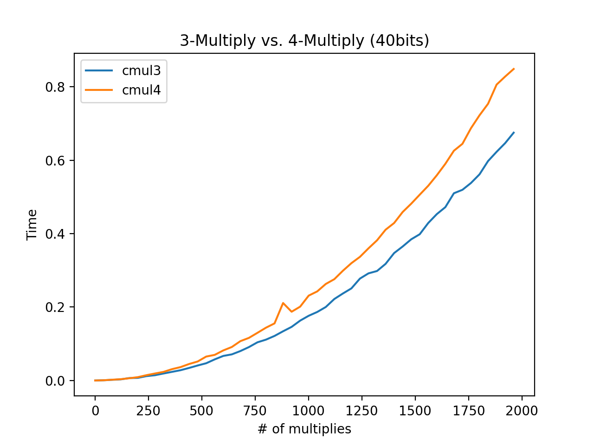
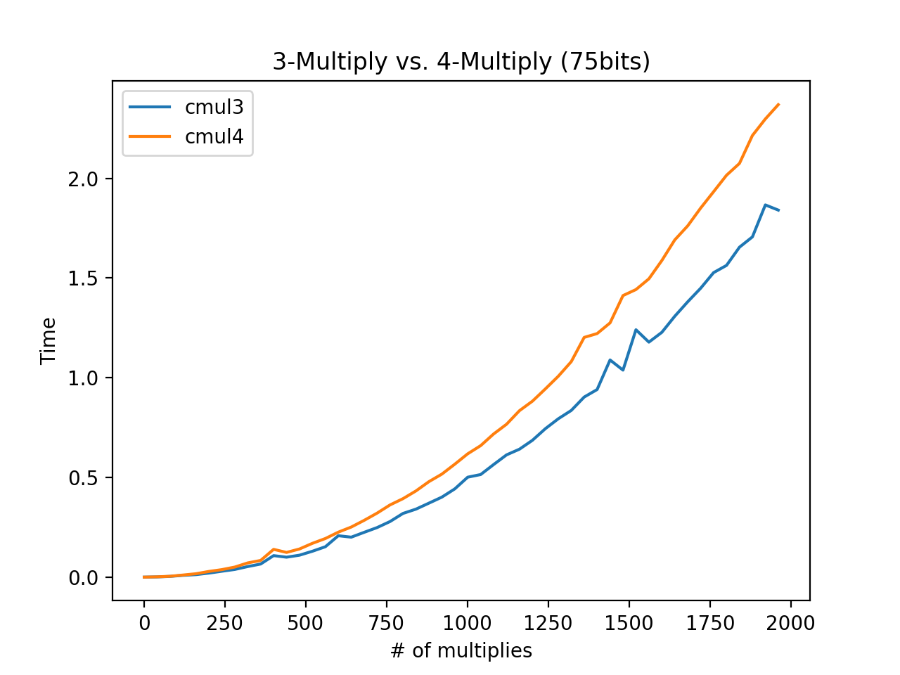
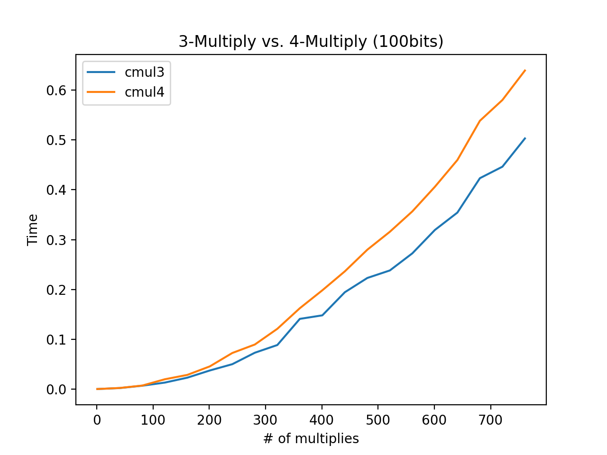
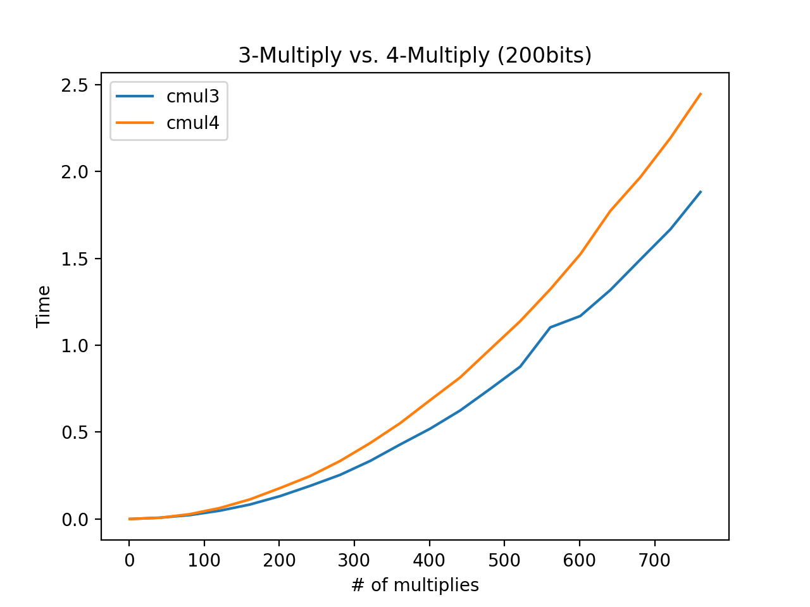

## CMSC Project 1 Report

**Contributors**:
- Christopher Sidell (csidell1@umbc.edu)
- Joshua Standiford (jstand1@umbc.edu)

### Psudocode (1)

#### 4-multiply

    let z1, z2, result be complex numbers
    r1 = z1.real * z2.real
    r2 = z1.imaginary * z2.imaginary
    
    i1 = z1.real * z2.imaginary
    i2 = z2.imaginary * z2.real
    
    result.real = r1 - r2
    result.imaginary = i1 + i2

#### 3-multiply

    let z1, z2, result be complex numbers
    t = (z1.real + z1.imaginary) * (z2.real + z2.imaginary)
    r = z1.real * z2.real
    s = z1.imaginary * z2.imaginary
    
    result.real = r - s
    result.imaginary = t - result.real
    
### Time Analysis Theoretical (2)

( See related file analysis.pdf )

### Time Analysis Empirical (3)

All lengths will be tried against 50 pairs of numbers

*50 8-bit*

Method | Trial, Time

- CMUL4
    
Mean: 0.0001851
Std Dev: 2.7449 E-5

- CMUL3 

Mean: 0.00020416
Std Dev: 4.8762 E-5

*50 8-bit*

cmul4 0.00013144 2.139616597354181e-06

cmul3 0.00013267999999999998 1.2845137251910088e-05

*50 10-bit*

cmul4 0.00013516 6.041894553525275e-06

cmul3 0.00013694 1.0116484829530585e-05

*50 20-bit*

cmul4 0.00016426 1.18989109431348e-05

cmul3 0.00015854 1.293344028288763e-05

*50 30-bit*

cmul4 0.00019176 8.828432731226758e-06

cmul3 0.00017888 6.258512570238776e-06

*50 40-bit*

cmul4 0.00020176 1.2011151281290262e-05

cmul3 0.00019098 2.0468482491630987e-05

*50 100-bit*

cmul4 0.0005741 0.00016098539038797075

cmul3 0.00050008 0.00011840639806210142

*50 200-bit*

cmul4 0.00143554 0.0001250397830569886

cmul3 0.00115614 0.00011236311581617148

## Machine Running Tests (4)

Processor 2GHz Intel Core i5
8GB RAM

## Crossover Point for bit length and num of multiplies

Below has graphs for many lists lengths and bit lengths. For a 50 bit
number multiplied x times the crossover point is around 30 multiplies
and starts to diverge more over increasing length.

For 50 multiplies of x number of bits the cross over point where cmul3
takes over is around 60 bit numbers and begins to diverge more around
75+ bits. 

## Closer look at 50 bit multiplies (5)

## Closer look at x bit 50 multiplies (5)

## Graphs for x Bit multiplies (5)

